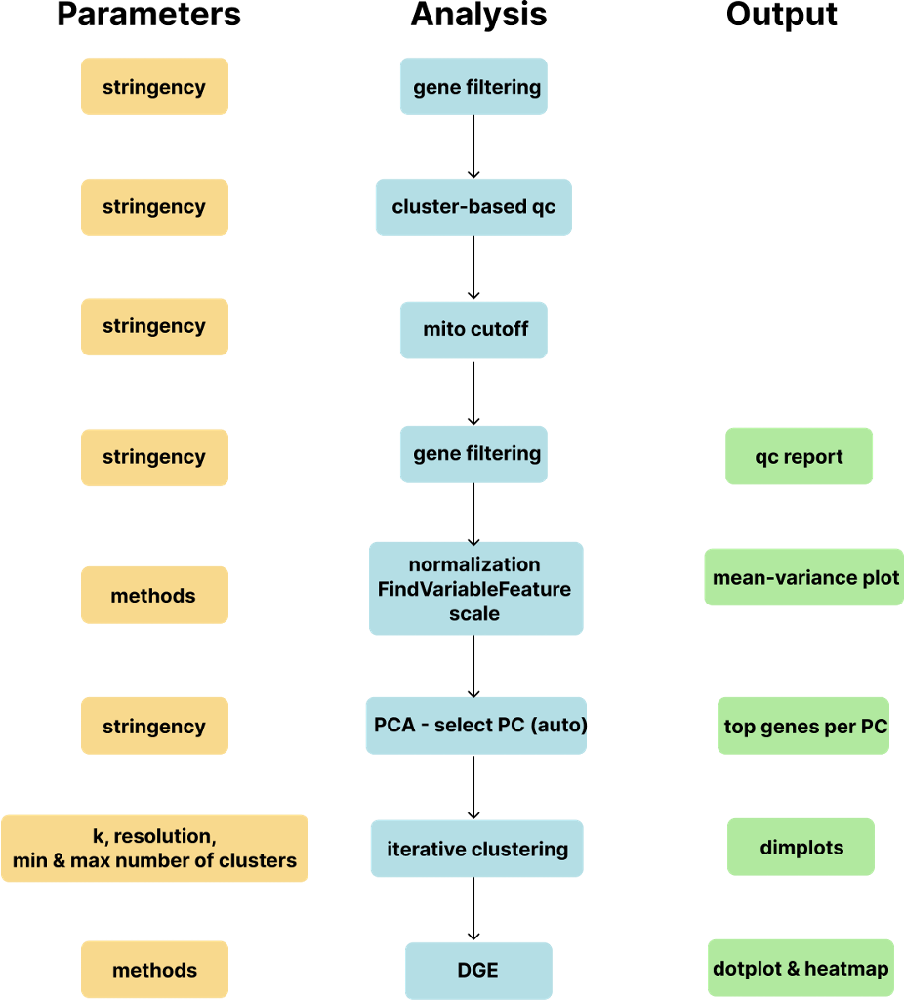

<!-- README.md is generated from README.Rmd. Please edit that file -->

```{r, include = FALSE}
knitr::opts_chunk$set(
  collapse = TRUE,
  comment = "#>",
  fig.path = "man/figures/README-",
  out.width = "100%"
)
```

<!-- badges: start -->
<!-- badges: end -->

**BioYourOwnBowl** is an R package for single-cell RNA-seq analysis based on Seurat, with utilities tailored for relatively homogeneous datasets. It streamlines iterative analysis by reducing manual overhead, such as figure sizing and repetitive parameter tuning.

The package provides an automated workflow for generating nuanced clustering and comprehensive visualizations to support evaluation. The workflow is modular: each function can be used independently, allowing users to assemble and customize their own analysis pipeline.

<p style="margin-top: 2em;">
  
</p>

## Installation

You can install the development version of BioYourOwnBowl from [GitHub](https://github.com/june-zhang-bioinfo/BioYourOwnBowl) with:

```{r eval=FALSE}
# install.packages("remotes")
remotes::install_github("june-zhang-bioinfo/BioYourOwnBowl")
```

## Key Features

- **End-to-end analysis**: define your parameters at once and get all results with one function.
- **Save parameters and session info automatically**: record how you get here.
- **Automated function**: low-quality cluster removal, select principal components by elbow plot.
- **Flexible variable feature selection**: vst, dispersion, pseudobulk, SCT, integration anchors
- **Clustering optimization**: parameter sweeps and save results with desired granularity only.
- **Advanced visualizations**: cell-level, pseudobulk-level and meta-level heatmaps, 2-dimensional volcano plots, density plot with scanpy, violin plots with pronounced non-zero distribution and statistical test, area proportional venn plots and treemaps.
- **Interacte with Python**: configurate python environment and run python in Rstudio.
- **cNMF visualization**: top genes per program, programs projection on UMAP, cNMF comparison heatmaps, gene locating.
- **Batch correction support**: via Harmony.

## Documentation

For a complete example workflow with detailed explanations, see [vignette](https://june-zhang-bioinfo.github.io/BioYourOwnBowl/).

## Quick Example

```{r eval=FALSE}
library(BioYourOwnBowl)
library(Seurat)
library(ggplot2)
library(dplyr)
library(tidyr)
library(tibble)
library(circlize)
library(grid)
library(RColorBrewer)
library(stringr)
library(grDevices)
library(stats)
library(utils)
library(jsonlite)
library(Matrix)
library(ComplexHeatmap)
library(pheatmap)
library(scCustomize)
library(rlang)
library(matrixStats)
library(sessioninfo)
library(yaml)

# Load example Seurat object
seurat_obj <- readRDS("path/to/example_seurat.rds")

# Run a minimal pipeline
seurat_obj <- optimize_single_cell(
  object = seurat_obj,
  vf.method = "vst",
  nfeatures = 2000,
  clusters_min = 5, 
  clusters_max = 12,
  out_dir = "results/"
)

```

## Main Functions

### Core Pipeline

- `optimize_single_cell()` - Full automated pipeline

### Quality Control
- `filter_genes_by_expression()` - Remove lowly expressed genes
- `remove_low_quality_clusters()` - Cluster-based cell filtering, based on the concept that low-quality cells tend to be clustered together and hard cutoff may not be thorough.

### Dimensionality Reduction & Clustering
- `select_PCs()` - Automated PC selection based on elbow plot. Adjustable stringency.
- `clustering()` - Parameter sweep for optimal clustering, allowing desired number of clusters.
- `export_top_pc_genes()` - Extract top genes per Principal Component for biological inspection.

### Visualizations
- `features_plots()` - Dynamic feature plot grids.
- `violin_plots()` - Combined violin/box/dot plots, showing non-zero distribution.
- `heatmap_cell_level()` - Cell-level expression heatmaps.
- `heatmap_pseudobulk()` - Pseudobulk heatmaps, usually used for participant level.
- `heatmap_meta()` - Meta-level averaged heatmaps.
- `stacked_bar_plots()` - Multi-layer categorical data distributions.
- `dotplots_pdf()` - dot plots with intelligent sizing, including 2 dot plots: genes from user's prior knowledge and unbiased DGE.
- `double_volcano()` - 2D volcano plots, showing 2 comparisons at the same time.
- `tcr_treemaps()` - Area proportional TCR clonotype visualizations.
- `venn_plots()` - Area proportional venn ploe of overlapped genes.

### Differential Expression
- `select_marker_genes_score()` - Product score based marker selection, takes both p-value and log2FC into account.

### cNMF Interpretaion
- `cnmf_bar_plots()` - Visualize top genes per program.
- `cnmf_umaps()` - UMAP plots for cNMF program values.
- `cnmf_top_programs` - Assign Primary, Secondary, Tietiary and Quaternary programs to cells.
- `compare_cnmf_programs()` - Compare programs to self or siblings.

### Interaction with Python
- `setup_python()` - Set up python environment for reticulate.
- `prepare_h5ad()` - Export to AnnData format for Python-based functions.
- `density_plot()` - Generate Scanpy density plot.


## Output Files

The `optimize_single_cell()` function generates:

- `logs/` - Parameters and session info
- `qc.pdf` - Quality control plots
- `HVG_info.csv` - The ranking of variable features and the number of cells express them
- `elbow.png` - PC selection plot
- `Mean-variance_*.png` - Variable feature plots
- `PCs_top-genes.csv` - Top genes per principal component
- `dimplot.pdf` - Dimplots showing clustering results
- `k*_r*_barplot.png` - Cluster distribution plots
- `k*_r*_dotplot.pdf` - Dot plots for each clustering, including selected features and DGE
- `k*_r*_heatmap.png` - Expression heatmaps for DGE
- `object.rds` - Final processed Seurat object

## Core Dependencies

- R 4.4.1
- Bioconductor: 3.20 (BiocManager 1.30.27)
- Seurat (=5.1.0)

## Citation

If you use this package in your research, please cite:

```
June Zhang (2025). BioYourOwnBowl: Single-cell RNA-seq Analysis Tools. 
R package version 0.1.0. https://github.com/june-zhang-bioinfo/BioYourOwnBowl
```

## License

MIT License. See [LICENSE](LICENSE) for details.

## Contact

- **Author**: June Zhang
- **Email**: zhang24925@gmail.com
- **GitHub**: [@june-zhang-bioinfo](https://github.com/june-zhang-bioinfo)

## Issues

Report bugs or feature requests at: https://github.com/june-zhang-bioinfo/BioYourOwnBowl/issues

---
